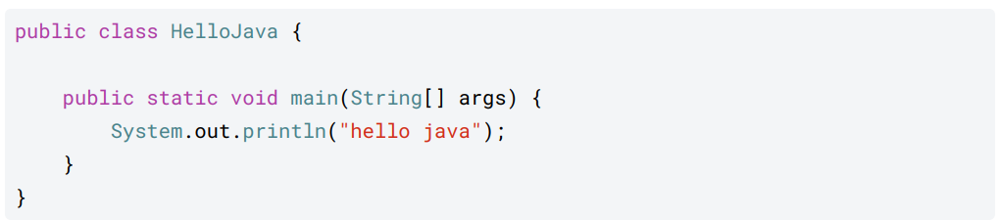
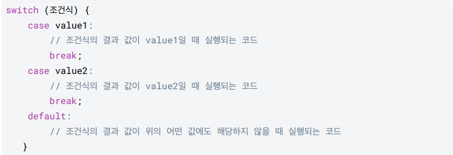
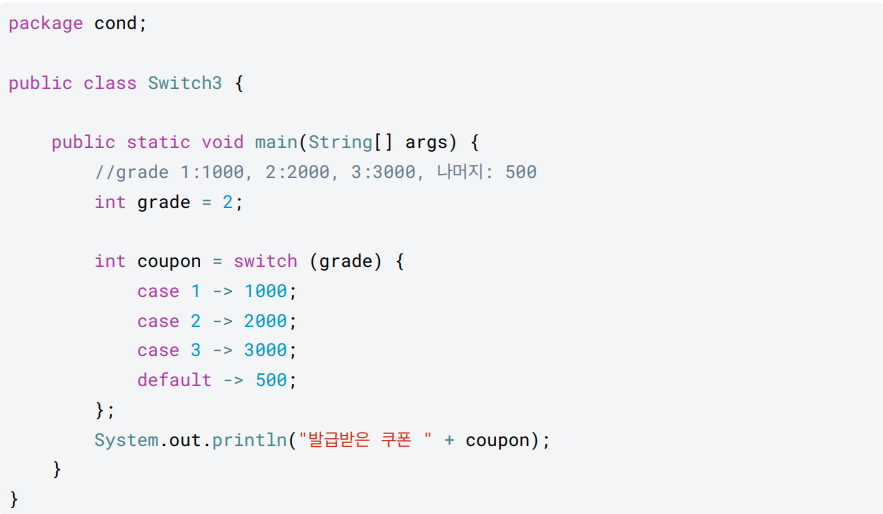

# 6/8

## 1. Hello World



- 자바 언어는 대소문자를 구분한다. 대소문자가 다르면 오류가 발생한다.

---

### public class HelloJava

- HelloJava 를 클래스라 한다.
- 단순히 HelloJava.java 라는 파일을 만들었다고 이해
- `파일명과 클래스 이름이 같아야 한다.`
- {} 블록을 사용해서 클래스의 시작과 끝을 나타낸다.
---

### public static void main(String[] args)

- main 메서드라 한다.
- 자바는 main(String[] args) 메서드를 찾아서 프로그램을 시작한다.
- main 은 프로그램의 시작점이라고 이해하면 된다.
- {} 블록을 사용해서 메서드의 시작과 끝을 나타낸다.

---

### System.out.println("hello java");

- System.out.println() : 값을 콘솔에 출력하는 기능이다.
- "hello java" : 자바는 문자열을 사용할 때 `" (쌍따옴표)`를 사용한다. 쌍따옴표 사이에 원하는 문자열을 감싸면 된다. (`' (따옴표)`는 불가능)
- ; : 자바는 세미콜론으로 문장을 구분한다. 문장이 끝나면 세미콜론을 필수로 넣어주어야 한다.
---

### 괄호

- 소괄호 : ()
- 중괄호 : {}
- 대괄호 : []
---
### 블록

- 블록( {} )이 시작되고 끝날 때 마다 들여쓰기가 적용되어 있는 것을 확인할 수 있다. 블록이 중첩될 때 마다 들여쓰기의 깊이가 추가된다.
- 들여쓰기는 스페이스 4번. IntelliJ IDE를 사용하면 키보드 Tab 을 한번 누르면 스페이스 4번을 적용한다.
---

## public static void main(String[] args) == psvm

## System.out.println(); == sout

### 주석

- 한 줄 주석 (single line comment) : //

- 여러 줄 주석(multi line comment) : /* ~ */

## 2. 변수

### 패키지 == 폴더

- 폴더 내의 새로운 파일을 만들때 파일의 맨 처음 글자는 대문자로 작성
---
### `변수는 무조건 초기화를 해줘야 한다.`
---
### (지역)변수 타입

- int : 정수
- double : 실수
- boolean : 불리언 타입이라 한다. true , false 값만 사용할 수 있다. 
- char : 문자 하나를 다룰 때 사용. `작은따옴표( ' )`를 사용해서 감싸야 한다. 
- String : 문자열을 다룬다. `큰따옴표(" ")`를 사용해야 한다.
  - `첫번째 글자가 대문자로 시작하는` 특별한 타입이다.
---
### 리터럴 : 고정된 값

- 정수 : int
- 실수 : double
---
### 자주 사용하는 변수 타입

- 정수 

  - int : 자바는 정수에 기본으로 int 를 사용한다. 
  - long : 만약 20억이 넘을 것 같으면 long 을 쓰면 된다.
    - 파일을 다룰 때는 byte 를 사용한다.

- 실수 : double 

- 불린형 : boolean

  - true , false 참 거짓을 표현한다. 
  - 조건문에서 자주 사용된다.

- 문자열 : String 

  - 문자를 다룰 때는 String 을 사용하는 것이 편리하다.
---
### 변수 명명 규칙
---
#### 규칙

- 자바의 예약어를 변수 이름으로 사용할 수 없다. (예: int , class , public )
- 변수 이름에는 영문자( a-z , A-Z ), 숫자( 0-9 ), 달러 기호( $ ) 또는 밑줄( _ )만 사용할 수 있다.

---
#### 관례

- Camel Case 사용

- 클래스 : 대문자로 시작
- 나머지 : 소문자로 시작
  

- 예시: 클래스는 첫 글자 대문자, 나머지는 모두 첫 글자 소문자로 시작 + 낙타 표기법

  - 클래스: Person , OrderDetail
  - 변수를 포함한 나머지: firstName , userAccount
  
- 여기에 예외가 딱 2개 있다.
  - 상수는 모두 대문자를 사용하고 언더바로 구분한다. (상수는 뒤에서 학습)
    - USER_LIMIT
  - 패키지는 모두 소문자를 사용한다. (패키지는 뒤에서 학습)
    - org.spring.boot
---

## 변수 정리

- 변수는 데이터를 담을 수 있는 통이다.
- `변수 초기화 : 변수에 처음으로 값을 대입해서 저장하는 것`
- ---

# 6/9

## 3. 연산자

### 자주 사용하는 연산자
---

- 산술 연산자 
  - `+` 
  - `-` 
  - `*` 
  - `/`
  - `%` 

- 증가 및 감소 연산자
  - `++` 
  - `--`

- 비교 연산자
  - `==` 
  - `!=` 
  - `>` 
  - `<` 
  - `>=` 
  - `<=`

- 논리 연산자
  - && (AND)
  - || (OR)
  - ! (NOT)

- 대입 연산자 
  - = 
  - += 
  - -= 
  - *= 
  - /= 
  - %=

---
## 4. 조건문

### if 문

- if
- else if
- else
---  
### switch 문



- 조건식의 결과 값이 어떤 case 의 값과 일치하면 해당 case 의 코드를 실행한다.
- break 문은 현재 실행 중인 코드를 끝내고 switch 문을 빠져나가게 하는 역할을 한다.
- 만약 break 문이 없으면, 일치하는 case 이후의 모든 case 코드들이 순서대로 실행된다.
- default 는 조건식의 결과값이 모든 case 의 값과 일치하지 않을 때 실행된다. if 문의 else 와 같다. 
  - default 구문은 선택이다.
- if , else-if , else 구조와 동일하다.

---
### 삼항 연산자

---
- `( 조건 ) ? 참_표현식 : 거짓_표현식`

  -  조건 , 참_표현식 , 거짓_표현식 이렇게 항이 3개이다. 특정 조건에 따라 결과가 나오기 때문에 조건 연산자라고도 한다.
  - 조건에 만족하면 참_표현식 이 실행되고, 조건에 만족하지 않으면 거짓_표현식 이 실행된다. 
  - if 문 처럼 코드 블럭을 넣을 수 있는 것이 아니라 단순한 표현식만 넣을 수 있다.

# 6/10

## 5. 반복문

### while 문
---
#### while 문을 사용하면 원하는 횟수 만큼 같은 코드를 반복 실행할 수 있다.

``` java
while (조건문) {
    // 코드
}
```

- 조건식을 확인한다. 
  - 참이면 코드 블럭을 실행한다. 
  - 거짓이면 while문을 벗어난다.
---
### do - while 문
---
#### do-while 문은 조건에 상관없이 무조건 한 번은 코드를 실행한다.
---

```java
do {
    //코드
} while (조건식);

```
---
### break, continue
---
#### break : 반복문을 즉시 종료하고 나간다. 

```java
while (조건식) {
    코드1;
    break;
    코드2;
}
```
  - break를 만나면 코드 2가 실행되지 않고 while문 종료된다.
---
#### continue : 반복문의 나머지 부분을 건너뛰고 다음 반복으로 진행하는데 사용된다.

```java
while (조건식) {
    코드1;
    continue;
    코드2;
}
```
  - continue를 만나면 코드 2가 실행되지 않고 다시 조건식으로 이동한다. 조건식이 참이면 while문을 실행한다.
---
### for 문

---
```java
for (초기식; 조건식; 증감식;) {
    코드
}
```

1. 초기식이 실행된다. 초기식은 딱 1번 사용된다.
2. 조건식을 검증한다. 참이면 코드를 실행하고, 거짓이면 for문을 빠져나간다.
3. 코드를 실행한다.
4. 코드가 종료되면 증감식을 실행한다. 
5. 다시 조건식부터 시작한다. (무한 반복)
---

#### for문에서 초기식, 조건식, 증감식은 선택이다. 
   - 단 생략해도 각 영역을 구분하는 `;` 은 유지해야 한다.

---

### 중첩 반복문
- 반복문은 내부에 또 반복문을 만들 수 있다.
---

### 정리
---
#### for 문

- 장점
  1. 초기화, 조건 체크, 반복 후의 작업을 한 줄에서 처리할 수 있어 편리하다.
  2. 정해진 횟수만큼의 반복을 수행하는 경우에 사용하기 적합하다.
  3. 루프 변수의 범위가 for 루프 블록에 제한되므로, 다른 곳에서 이 변수를 실수로 변경할 가능성이 적다.
---
- 단점
  1. 루프의 조건이 루프 내부에서 변경되는 경우, for 루프는 관리하기 어렵다.
  2. 복잡한 조건을 가진 반복문을 작성하기에는 while문이 더 적합할 수 있다.
---

#### while문

- 장점:
  1. 루프의 조건이 루프 내부에서 변경되는 경우, while 루프는 이를 관리하기 쉽다.
  2. for 루프보다 더 복잡한 조건과 시나리오에 적합하다.
  3. 조건이 충족되는 동안 계속해서 루프를 실행하며, 종료 시점을 명확하게 알 수 없는 경우에 유용하다.
---
- 단점:
  1. 초기화, 조건 체크, 반복 후의 작업이 분산되어 있어 코드를 이해하거나 작성하기 어려울 수 있다.
  2. 루프 변수가 while 블록 바깥에서도 접근 가능하므로, 이 변수를 실수로 변경하는 상황이 발생할 수 있다.
---

# 6/11

## 6. 스코프, 형변환

### 스코프
---
- 변수의 접근 가능한 범위

- 변수는 꼭 필요한 범위로 한정해서 사용하는 것이 좋다. 
- 변수의 스코프는 꼭 필요한 곳으로 한정해서 사용하자. 

---

### 형변환
---
#### int -> long -> double
- 작은 범위에서 큰 범위로는 대입할 수 있다.
  - 이것을 묵시적 형변환 또는 자동 형변환이라 한다.

- 큰 범위에서 작은 범위의 대입은 문제가 발생할 수 있다. 이때는 명시적 형변환을 사용해야 한다.
  - 소수점 버림
  - 오버플로우

- 연산과 형변환
  - 같은 타입은 같은 결과를 낸다.
  - 서로 다른 타입의 계산은 큰 범위로 자동 형변환이 일어난다.
---

## 7. 훈련

### Scanner
---

```java
package chap7;

import java.util.Scanner;

public class Scanner1 {
    public static void main(String[] args) {

        Scanner scanner = new Scanner(System.in);

        System.out.print("문자열을 입력하세요 : ");
        String str = scanner.nextLine();
        System.out.println("입력한 문자열 : " + str);

        System.out.print("정수를 입력하세요 : ");
        int intValue = scanner.nextInt();
        System.out.println("입력한 정수 : " + intValue);

        System.out.print("실수를 입력하세요 : ");
        double doubleValue = scanner.nextDouble();
        System.out.println("입력한 실수 : " + doubleValue);
    }
}
```

- `Scanner scanner = new Scanner(System.in);`
  - new 를 사용해서 Scanner 를 만든다.
  - Scanner 는 System.in 을 사용해서 사용자의 입력을 편리하게 받도록 도와준다.

- `scanner.nextLine()`
  - `엔터( \n )`을 입력할 때 까지 문자를 가져온다.

- `scanner.nextInt()`
  - 입력을 int(정수) 로 가져온다.

- `scanner.nextDouble()`
  - 입력을 double(실수)으로 가져온다.

### print() vs println()

- print() : 출력하고 다음 라인으로 넘기지 않는다.
- println() : 출력하고 다음 라인으로 넘긴다.
---

# 6/13

## 8. 배열

### 배열 선언, 생성

```java 
int [] students; // 배열 변수 선언
students = new int[5]; // 배열 생성
```
---
### 배열 사용

```java
//변수 값 대입
students[0] = 90;
students[1] = 80;
//변수 값 사용
System.out.println("학생1 점수: " + students[0]);
System.out.println("학생2 점수: " + students[1]);
```

- 배열의 인덱스는 0부터 시작한다.
---
### 기본형 VS 참조형

- 기본형 : 변수에 사용할 값을 직접 넣을 수 있는 타입
  - int, long, double, boolean
- 참조형 : 데이터에 접근하기 위한 참조(주소)를 저장하는 데이터 타입
  - 객체, 클래스
---
### 배열 리펙토링

- 리펙토링 : 기존의 코드 기능은 유지하면서 내부 구조를 개선하여 가독성을 높이고, 유지보수를 용이하게 하는 과정
- 중복을 제거하고, 복잡성을 줄이며, 이해하기 쉬운 코드로 만든다.
---
### 배열 리펙토링 - 초기화

```java
int [] students;
students = new int[] {90,80,70,60,50};
```
---
### 2차원 배열

- `int [][] arr = new int[2][3]`

```java
int[][] arr = new int[2][3]; // 2x3 2차원 배열, 초기화
int i = 1;
 // 순서대로 1씩 증가하는 값을 입력한다.

 for (int row = 0; row < arr.length; row++) {
    for (int column = 0; column < arr[row].length; column++) { arr[row][column] = i++;
    }
 }

 // 2차원 배열의 길이를 활용
 for (int row = 0; row < arr.length; row++) {
    for (int column = 0; column < arr[row].length; column++) {
        System.out.print(arr[row][column] + " ");
    }
    System.out.println();
 }
```
---

### 2차원 배열 생성

```java
int [][] arr = {
    {1,2,3},
    {4,5,6}
}; 
```
---
### for - each 문 (단축키 == iter)

- for - each 문 정의

```java
for (변수 : 배열 또는 컬렉션) {
    // 배열 또는 컬렉션의 요소를 순회하면서 수행할 작업
}
```
---

- 예시

```java
int[] numbers = {1, 2, 3, 4, 5}; // 1차원 배열 생성

for (int number : numbers) {
    System.out.println(number);
}
```
---
- 배열의 인덱스를 사용하지 않고, 종료 조건을 주지 않아도 된다. 
- 단순히 해당 배열을 처음부터 끝까지 탐색한다.
- 배열의 인덱스를 사용하지 않고도 배열의 요소를 순회할 수 있기 때문에 코드가 간결하고 가독성
이 좋다.
---